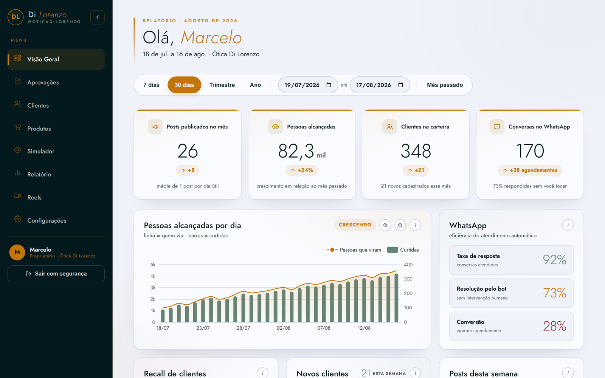
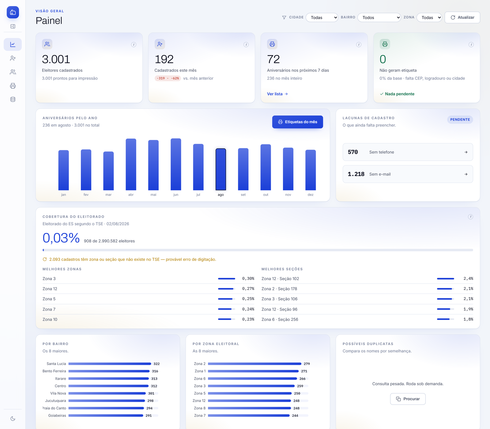
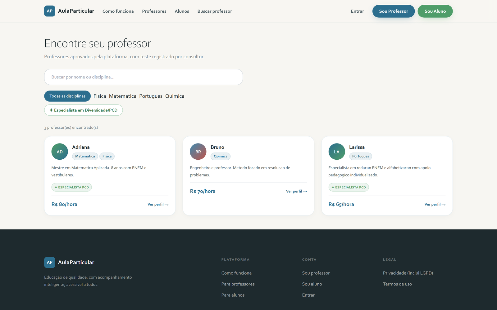

# Maycon Bruno

**I build systems that remove manual work from processes running on spreadsheets.**

Full-stack engineer from Rio de Janeiro, Brazil. Python and PostgreSQL on the back
end, TypeScript and React on the front, and I run what I build on Linux servers.
Available 10:00 to 19:00 BRT, which covers US business hours.

---

## In production

| What | Number |
|---|---|
| Payment documents issued and delivered, over an 8.1 GB PostgreSQL database | **200,124** |
| Monthly cross-platform record sync, after automation | **484 hours to 1** |
| Records kept in sync across platforms, with hash-based change detection | **11,620** |
| WhatsApp interactions on an automated customer channel | **20,775** |
| Campuses served by the systems above | **14** |

---

## Selected work

### VisaoPost · scheduling and analytics platform

Multi-tenant platform running in production for a paying client. FastAPI,
PostgreSQL, Redis queues and background workers, third-party marketing API, React
front end with role-based access.

It includes a reach-prediction model gated behind a minimum-sample threshold, with
a heuristic covering the same interface below it, so the system never reports
confidence it does not have.

I own the platform; the client holds a usage licence.

---

### Constituent registry · desktop and web from one codebase

FastAPI with psycopg3 connection pooling over PostgreSQL, fuzzy name and address
search on `pg_trgm` indexes, session auth with bcrypt, TypeScript and Vite front
end with tests in Vitest.

The dashboard cross-references the registry against the official electoral
dataset, reports coverage by district and section, and flags records whose
district does not exist upstream, which surfaces data-entry errors that would
otherwise go unnoticed. Twelve print-ready label and report formats, rendered
server-side with reportlab and previewed in the browser before printing.

---

### [AulaParticular](https://programa-particular-landing.vercel.app) · tutoring platform

Astro and Tailwind CSS for the public landing, React and Vite for the dashboard
across four roles, FastAPI with SQLAlchemy and Alembic over PostgreSQL, video
lessons from Cloudflare R2 over HLS.

Tutor search calls the live API and falls back to a static snapshot when no
backend is running, so the site stays demonstrable without a server. In active
development. Interface is in Portuguese, built for the Brazilian market.

**Live:** https://programa-particular-landing.vercel.app

---

## Why this account looks quieter than my work

Most of what I have shipped in the last three years is not here. Client platforms
are private, work done as an employee belongs to the employer, and contract work
is covered by confidentiality agreements. The public repositories on this account
are mostly coursework from when I was learning.

If you want to see production code, ask me and I will walk you through what I can
show, live.

---

## Stack

**Also:** SQLAlchemy · Alembic · Redis · pandas · Playwright · pytest · Vitest ·
Nginx · React Native · PHP

---

BSc in Information Systems, Estácio de Sá · Postgraduate specialization in Big
Data and Cloud Computing, Facuminas · CS50P, HarvardX
